<p align="center">
  
  
  
  
  
  
</p>

# Flight Streaming Pipeline

> **DataDesigner &rarr; NDJSON Stream &rarr; Apache Arrow &rarr; DuckDB &rarr; Apache Iceberg**

A fully tested, end-to-end streaming pipeline that generates synthetic flight arrival and departure data following [NVIDIA NeMo DataDesigner](https://nvidia-nemo.github.io/DataDesigner/latest/) patterns, streams it as newline-delimited JSON, ingests via Apache Arrow zero-copy into DuckDB, and catalogs it in Apache Iceberg with snapshot-based version control.

Diagrams styled with [**beautiful-mermaid**](https://github.com/lukilabs/beautiful-mermaid).

---

## Table of Contents

- [Architecture Overview](#architecture-overview)
- [Pipeline Flowchart](#pipeline-flowchart)
- [Flight State Machine](#flight-state-machine)
- [Sequence Diagram — Pipeline Execution](#sequence-diagram--pipeline-execution)
- [Class Diagram](#class-diagram)
- [Entity-Relationship Diagram](#entity-relationship-diagram)
- [Project Structure](#project-structure)
- [Getting Started](#getting-started)
- [Running Tests](#running-tests)
- [TDD Feature Breakdown](#tdd-feature-breakdown)
- [License](#license)

---

## Architecture Overview

```mermaid
%%{init: {'theme': 'base', 'themeVariables': { 'primaryColor': '#6366f1', 'primaryTextColor': '#ffffff', 'primaryBorderColor': '#4f46e5', 'lineColor': '#a5b4fc', 'secondaryColor': '#f0abfc', 'tertiaryColor': '#e0e7ff', 'fontSize': '14px' }}}%%
graph LR
    subgraph " "
        direction LR
        A["🎲 <b>DataDesigner</b><br/>Synthetic Generator"]
        B["📄 <b>NDJSON</b><br/>JSON Stream"]
        C["🏹 <b>Apache Arrow</b><br/>Zero-Copy Table"]
        D["🦆 <b>DuckDB</b><br/>Analytical Queries"]
        E["🧊 <b>Apache Iceberg</b><br/>Versioned Catalog"]
    end

    A -->|"generate(n)"| B
    B -->|"stream_to_file()"| C
    C -->|"register() zero-copy"| D
    C -->|"append()"| E
    D -.->|"query"| E

    style A fill:#6366f1,stroke:#4f46e5,color:#fff,stroke-width:2px
    style B fill:#f59e0b,stroke:#d97706,color:#fff,stroke-width:2px
    style C fill:#ef4444,stroke:#dc2626,color:#fff,stroke-width:2px
    style D fill:#facc15,stroke:#eab308,color:#000,stroke-width:2px
    style E fill:#3b82f6,stroke:#2563eb,color:#fff,stroke-width:2px
```



---

## Pipeline Flowchart

The complete data flow from generation through to queryable Iceberg tables, including error handling and branching logic.


---

## Flight State Machine

Every `FlightRecord` has a `status` field governed by this state diagram. The generator uses weighted random selection across these states.

```mermaid
%%{init: {'theme': 'base', 'themeVariables': { 'primaryColor': '#6366f1', 'primaryTextColor': '#fff', 'primaryBorderColor': '#4f46e5', 'lineColor': '#a5b4fc', 'fontSize': '13px' }}}%%
stateDiagram-v2
    direction LR

    [*] --> Scheduled : Flight created

    Scheduled --> Boarding : Gate open
    Scheduled --> Delayed : Delay detected
    Scheduled --> Cancelled : Flight cancelled

    Boarding --> Departed : Doors closed

    Delayed --> Boarding : Delay resolved
    Delayed --> Cancelled : Cancelled after delay

    Departed --> InAir : Airborne
    Departed --> Diverted : Rerouted on ground

    InAir --> Landed : Touchdown
    InAir --> Diverted : Emergency / weather

    Landed --> Arrived : At gate

    Diverted --> Landed : Diverted landing

    Arrived --> [*]
    Cancelled --> [*]

    state Scheduled {
        direction LR
        [*] --> Waiting
        Waiting --> GateAssigned
    }

    note right of Scheduled
        Weight: 25%
    end note

    note right of Delayed
        Weight: 10%
        delay_minutes: 15–300
    end note

    note right of Cancelled
        Weight: 3%
        delay_minutes: 0
    end note

    note left of Diverted
        Weight: 2%
    end note
```



---

## Sequence Diagram — Pipeline Execution

The full interaction between components during a single pipeline run.


---

## Class Diagram

The object model and relationships between all source modules.


---

## Entity-Relationship Diagram

The logical data model as it exists across DuckDB tables and the Iceberg catalog.


---

## Project Structure

```
flight-streaming-pipeline/
├── pyproject.toml                          # Build config, pytest markers
├── requirements.txt                        # Pinned dependencies
├── src/
│   ├── generators/
│   │   ├── models.py                       # FlightRecord, FlightStatus, FlightType
│   │   └── flight_generator.py             # DataDesigner-pattern generator
│   ├── streaming/
│   │   └── json_stream.py                  # NDJSON serialization & file/buffer IO
│   ├── ingestion/
│   │   └── arrow_loader.py                 # Arrow ↔ DuckDB zero-copy loader
│   └── catalog/
│       └── iceberg_catalog.py              # Iceberg catalog, table, snapshot mgmt
├── tests/
│   ├── conftest.py                         # Shared fixtures (generator, DuckDB, paths)
│   ├── feature_1_data_generation/          # 25 tests — schema, determinism, constraints
│   ├── feature_2_json_streaming/           # 20 tests — serialization, round-trip, edge cases
│   ├── feature_3_arrow_ingestion/          # 15 tests — Arrow load, DuckDB queries, fidelity
│   ├── feature_4_iceberg_catalog/          # 16 tests — catalog CRUD, snapshots, scans
│   └── feature_5_e2e_regression/           # 12 tests — full pipeline, determinism, integrity
└── data/
    ├── raw/                                # Generated NDJSON files (gitignored)
    └── iceberg/                            # Iceberg warehouse (gitignored)
```

---

## Getting Started

### Prerequisites

- Python 3.10+
- pip

### Install

```bash
git clone https://github.com/JohnDinsdale43/flight-streaming-pipeline.git
cd flight-streaming-pipeline
pip install -r requirements.txt
```

### Quick Run

```python
from src.generators.flight_generator import FlightDataGenerator
from src.streaming.json_stream import stream_to_file
from src.ingestion.arrow_loader import load_ndjson_to_duckdb
from src.catalog.iceberg_catalog import create_catalog, append_arrow_to_iceberg
from src.ingestion.arrow_loader import ndjson_file_to_arrow
import duckdb

# 1. Generate 500 flights
gen = FlightDataGenerator(seed=42)
records = gen.generate(500)

# 2. Stream to NDJSON
stream_to_file(records, "data/raw/flights.ndjson")

# 3. Load into DuckDB via Arrow
con = duckdb.connect(":memory:")
load_ndjson_to_duckdb("data/raw/flights.ndjson", con, "flights")

# 4. Query
print(con.execute("SELECT status, count(*) FROM flights GROUP BY status").fetchall())

# 5. Catalog in Iceberg
catalog = create_catalog("data/iceberg")
arrow_table = ndjson_file_to_arrow("data/raw/flights.ndjson")
append_arrow_to_iceberg(catalog, arrow_table)
```

---

## Running Tests

```bash
# Full suite (88 tests)
pytest tests/ -v --cov=src

# By feature
pytest -m feature_1 -v          # Data generation (25 tests)
pytest -m feature_2 -v          # JSON streaming  (20 tests)
pytest -m feature_3 -v          # Arrow ingestion (15 tests)
pytest -m feature_4 -v          # Iceberg catalog (16 tests)
pytest -m feature_5 -v          # E2E regression  (12 tests)
```

---

## TDD Feature Breakdown

### Feature 1 — Data Generation (25 tests)

| ID | Test | Validates |
|----|------|-----------|
| 1.1 | Schema validation | Every record passes Pydantic validation |
| 1.2 | Determinism | Same seed → identical output |
| 1.3 | Batch generation | `generate(n)` returns exactly n records |
| 1.4 | Streaming generation | `stream(n)` yields exactly n records |
| 1.5 | Field constraints | Airport codes uppercase, flight_number in range |
| 1.6 | Status distribution | All 9 statuses appear given enough records |
| 1.7 | Delay logic | Delayed → delay > 0; Cancelled → delay = 0 |
| 1.8 | Airport pairs | Origin ≠ destination |
| 1.9 | Edge: zero | `generate(0)` → empty list |
| 1.10 | Edge: one | `generate(1)` → single valid record |

### Feature 2 — JSON Streaming (20 tests)

| ID | Test | Validates |
|----|------|-----------|
| 2.1 | Single record | Valid JSON, no embedded newlines |
| 2.2 | NDJSON string | Correct line count, each line parseable |
| 2.3 | File streaming | Writes correct number of lines |
| 2.4 | File round-trip | Write → read back preserves all fields |
| 2.5 | Buffer streaming | BytesIO contains valid NDJSON, position = 0 |
| 2.6 | Empty input | Produces empty string / file / buffer |
| 2.7 | Large batch | 1,000 records stream without error |
| 2.8 | Line counting | `count_lines()` matches written count |
| 2.9 | Datetime | ISO-8601 format preserved through serialization |
| 2.10 | Special chars | Airline names survive round-trip |

### Feature 3 — Arrow Ingestion (15 tests)

| ID | Test | Validates |
|----|------|-----------|
| 3.1 | File → Arrow | Correct row count and columns |
| 3.2 | Buffer → Arrow | Same fidelity as file path |
| 3.3 | Arrow → DuckDB create | Table exists with correct row count |
| 3.4 | Arrow → DuckDB append | Rows accumulate across appends |
| 3.5 | Schema inspection | DuckDB columns match expected schema |
| 3.6 | Filtered query | WHERE clause returns correct subset |
| 3.7 | Convenience load | Single-call NDJSON → DuckDB |
| 3.8 | Missing file | Raises `FileNotFoundError` |
| 3.9 | Empty file | Loads zero rows or raises gracefully |
| 3.10 | Data fidelity | Values survive NDJSON → Arrow → DuckDB |

### Feature 4 — Iceberg Catalog (16 tests)

| ID | Test | Validates |
|----|------|-----------|
| 4.1 | Catalog creation | SqlCatalog initializes, catalog.db exists |
| 4.2 | Table creation | Flights table has correct field names |
| 4.3 | Idempotent create | Calling twice returns same table handle |
| 4.4 | Append data | Row count matches after append |
| 4.5 | Multiple appends | Rows accumulate across appends |
| 4.6 | Full scan | Returns Arrow table with all rows |
| 4.7 | Filtered scan | Filter expression returns subset |
| 4.8 | Snapshot tracking | Each append creates a new snapshot |
| 4.9 | Warehouse cleanup | `drop_warehouse()` removes directory |
| 4.10 | Schema field count | Iceberg schema has exactly 15 fields |

### Feature 5 — End-to-End Regression (12 tests)

| ID | Test | Validates |
|----|------|-----------|
| 5.1 | Full pipeline | Generate → stream → ingest → catalog → query |
| 5.2 | Determinism | Same seed → identical DuckDB data across runs |
| 5.3 | Large dataset | 500 records end-to-end without error |
| 5.4 | Row count consistency | DuckDB and Iceberg counts match |
| 5.5 | DuckDB aggregation | GROUP BY, AVG queries return correct totals |
| 5.6 | Iceberg query | Scan returns all expected columns |
| 5.7 | Multiple runs | Iceberg accumulates, DuckDB replaces |
| 5.8 | Data integrity | Spot-check field values survive full pipeline |

---

## Design Decisions

| Decision | Rationale |
|----------|-----------|
| **DataDesigner pattern** | Schema-first generation with constraint pools (airports, airlines, status weights). Swappable to LLM-backed DataDesigner when endpoint available. |
| **NDJSON format** | Each line is an independent JSON object — ideal for incremental Arrow parsing and streaming ingestion. |
| **Arrow zero-copy** | DuckDB's `register()` creates virtual views over Arrow memory — no serialization overhead. |
| **FsspecFileIO** | Solves PyIceberg's PyArrow local filesystem path resolution issues on Windows (`C:\` parsed as URI scheme). |
| **LongType + nullable** | Iceberg schema uses `LongType` (int64) and `required=False` to match Arrow's default nullable int64 from JSON parsing. |
| **Deterministic seeds** | Every generator accepts a `seed` parameter — tests are fully reproducible across platforms. |

---

## License

MIT
